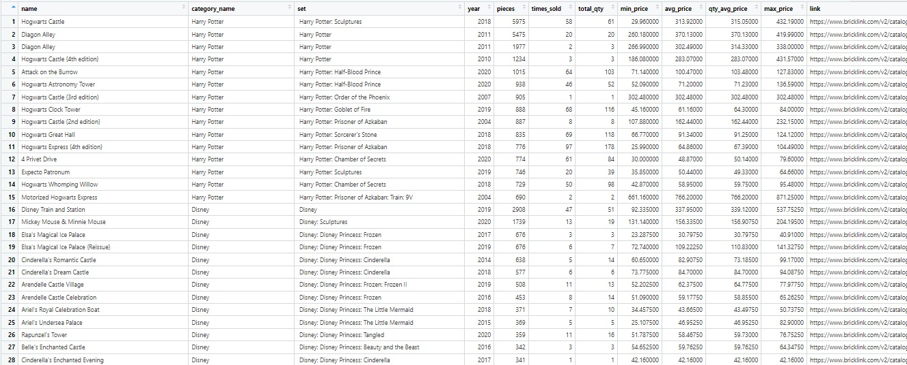

# Lego Scraper for R

An R-based web scraping project to extract designed to extract historical price data from [BrickLink](https://www.bricklink.com/v2/main.page) a popular marketplace for [LEGO](https://www.lego.com/es-es) sets and pieces and the official [LEGO](https://www.lego.com/es-es) website.

Our primary motivation for undertaking this project was to explore the factors that drive the revaluation of LEGO sets, to analyse how their prices change over time, and to identify which sets offer the highest return on investment. With these results, we can discover patterns that influence the desirability and long-term value of certain sets. These insights can also serve as a foundation for similar projects.

## 📋 Requirements

Proper collection and subsequent analysis will require:

-   R and R Studio correctly installed and updated
-   Required packages: *rvest*, *xml2*, *httr*, *stringr*, *tidyverse*, *tibble*, *readr*

This project will not require any interaction with Web APIs or any open-source automation tool such as Selenium. However, to fully perform the analysis it will require a VPN changing tool to extract all the information contained in the price guide of the product. After trying many options, we found that this was the most useful tool available to analyze different products without being banned from the website. In this case, we used the SurfShark application, but any other VPN switching tool can be used. It must be addressed that the maximum number of product prices that could be scraped without receiving only missing values is 17.

## 🔎How it works?

This project aims to collect information about the market price of second-hand Legos in the following categories selected: *Town*, *Disney*, *Harry Potter*, *The Hobbit and The Lord of the Rings*, *Super Heroes*, *Star Wars* and *Super Mario*.

To do this, we created an Rmd document with which, using different web scraping tools within R, we were able to extract relevant information about the sets of these categories.

### Summary of the project

The project uses exclusively R language and is divided into these main sections:

-   Web scraping on the official LEGO website

<!-- -->

-   Bricklink environment familiarization

-   Select the main categories on the sets page

-   Scraping process to obtain all the sets available

-   Final data harvesting to obtain all the relevant product data:

    -   Name and link

    -   Number of pieces

    -   Year of the product

    -   Historical product prices (this step would require VPN switching)

In this case, all prices were either expressed in euros or were converted into euros at current exchange rates.

## 📊 Extracted Data

## 

#### 🤝 All types of contributions and improvements are welcome!
